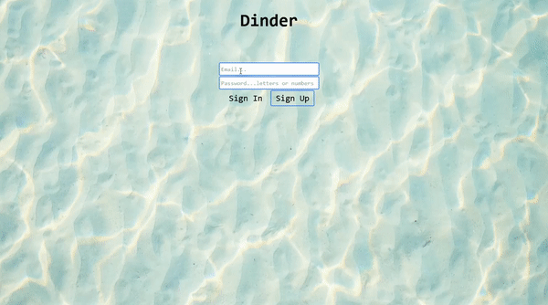

# Dinder

Dinder is a Tinder-like app to set profile name and picture and check out other pictures depending on preference. 
It involves thorough back-end validation for all the input. Unique IDs are generated based on the current time in microseconds
to manage media storage, with symlink for access. 
The app is written in PHP using MVC architecture and Service-Repository pattern. The front-end is built with Twig and JavaScript.