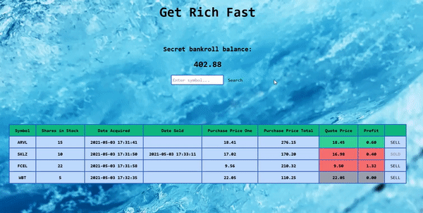

# Investment Tool

With this app, one can use stock tickers to buy and sell stock. 
Stock data is populated with help of [Finnhub Stock API](https://github.com/Finnhub-Stock-API/finnhub-php) and refreshed
every 5 seconds. The profit column carries green, grey, or red background depicting positive, neutral, or negative profit. 
Application back-end is written in PHP using MVC architecture and Service-Repository pattern.
Twig is used for application front-end with a little touch of Vanilla JS.